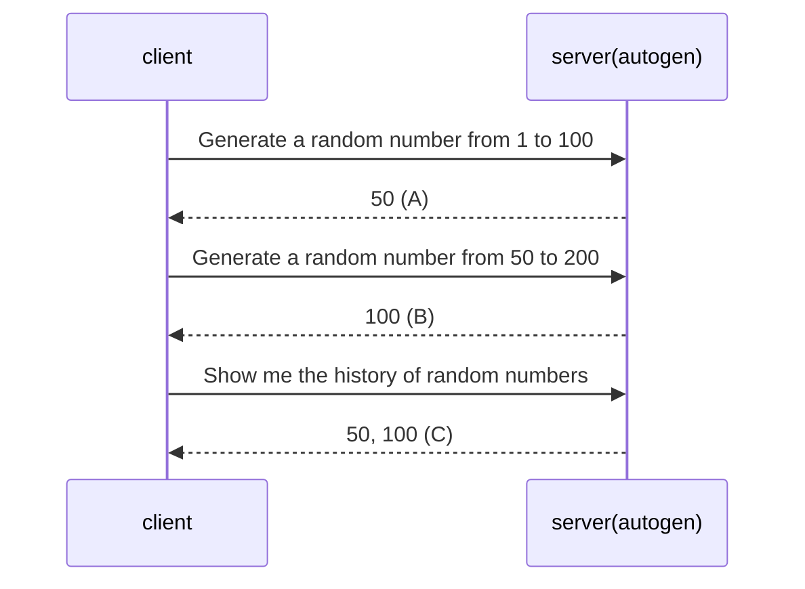

# Auogen Memory Store

This is a sample project that demonstrates how to use autogen's `save_state` and `load_state` functions to save and load the state of a Python object. It uses a custom memory store that implements the `MemoryStore` interface.

For illustration, we will use a simple example of generating random numbers and keeping track of the history of generated numbers.


at `(A)`, the server has a new state.
at `(B)`, the server has restore the state from the previous request.
at `(C)`, the server also restores the state from the previous request and is able returns the history of random numbers.

## setup project

### Prerequisites

1. Install uv [guide](https://docs.astral.sh/uv/getting-started/installation/)

### Setup

```bash
cd <this project folder>
uv sync
pre-commit install
cp .env.example .env
```

you do not need to do `uv init` because we have already done it for you.

### Activate virtual environment

MacOS/Linux

```bash
source .venv/bin/activate
```

Windows

```bash
.venv\Scripts\activate
```

### vscode extensions
1. code . (open the project in vscode)
1. install the recommended extensions (cmd + shift + p -> `Extensions: Show Recommended Extensions`)

# Run the sample app

```bash
python -m autogen_memory_store.main
```


# Testing

## Unit Tests

```bash
python -m pytest -p no:warnings --cov-report term-missing --cov=autogen_memory_store tests
```

## Linting
these are handled by pre-commit hooks

```sh
ruff format .
```

```sh
ruff check .
```

```sh
pyright .
```

## generate requirements.txt
these are handled by pre-commit hooks

```sh
uv lock
uv export --frozen --no-dev --output-file=requirements.txt
uv export --frozen --all-groups --output-file=requirements.dev.txt
```

## packages scanning
these are handled by pre-commit hooks

```sh
pip-audit -r requirements.txt
```